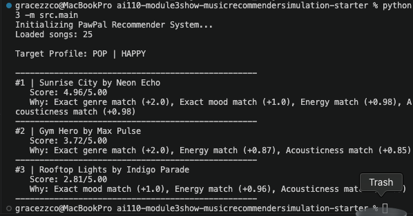

# 🎵 Music Recommender Simulation

## Project Summary

In this project you will build and explain a small music recommender system.

Your goal is to:

- Represent songs and a user "taste profile" as data
- Design a scoring rule that turns that data into recommendations
- Evaluate what your system gets right and wrong
- Reflect on how this mirrors real world AI recommenders

Replace this paragraph with your own summary of what your version does.

---

## How The System Works

Explain your design in plain language.

Some prompts to answer:

- What features does each `Song` use in your system
  - For example: genre, mood, energy, tempo
Each song in this system uses two primary numerical features: mood and danceability. Both of these attributes are measured on a normalized scale from 0.0 to 1.0 so they can be evaluated equally.

- What information does your `UserProfile` store
The user profile stores the listener's ideal target values for both mood and danceability, representing their specific acoustic preferences. It also stores the mathematical weights assigned to each feature, which determine if the user currently cares more about matching the mood or matching the danceability.

- How does your `Recommender` compute a score for each song
The recommender calculates the absolute distance between the song's features and the user's preferred values to determine exactly how far apart they are. It then converts that distance into a similarity score (using a formula like 1 - distance), ensuring that songs closer to the user's exact preference point receive a higher score.

- How do you choose which songs to recommend
The system calculates a final, weighted score for every song in the catalog and ranks them from highest to lowest. It then selects and recommends the songs at the very top of this ranked list because they are the tightest match to the user's desired profile.


## How The System Works

The recommendation engine uses a Content-Based Filtering approach. It compares the attributes of every song in our database (`songs.csv`) against a predefined user profile to calculate a "Similarity Score."

### The Algorithm Recipe
The system uses a weighted point system (max score of 5.0) to balance exact category matches with numerical feature similarity:
1. Genre Match: +2.0 points if the genre matches the user's favorite.
2. Mood Match: +1.0 point if the mood matches the user's favorite.
3. Energy Proximity:Up to +1.0 point based on how close the song's energy level is to the user's target `(1.0 - absolute difference)`.
4. Acoustic Proximity: Up to +1.0 point based on how close the song's acousticness is to the user's target `(1.0 - absolute difference)`.

### Data Flow Diagram

```mermaid
flowchart TD
    A[User Profile] --> C
    B[songs.csv Catalog] --> C
    
    C{For Every Song in Catalog}
    C -->|Calculate Categorical Points| D[Check Genre & Mood Match]
    C -->|Calculate Numerical Similarity| E[Compute Distance for Energy & Acousticness]
    
    D --> F[Sum Total Score]
    E --> F
    
    F --> G[Append Song + Score to Results List]
    
    G --> H{All songs checked?}
    H -->|No| C
    H -->|Yes| I[Sort List by Highest Score]
    
    I --> J[Output Top K Recommendations]



Initializing PawPal Recommender System...
Loaded songs: 25

Target Profile: POP | HAPPY

--------------------------------------------------
#1 | Sunrise City by Neon Echo
   Score: 4.96/5.00
   Why: Exact genre match (+2.0), Exact mood match (+1.0), Energy match (+0.98), Acousticness match (+0.98)
--------------------------------------------------
#2 | Gym Hero by Max Pulse
   Score: 3.72/5.00
   Why: Exact genre match (+2.0), Energy match (+0.87), Acousticness match (+0.85)
--------------------------------------------------
#3 | Rooftop Lights by Indigo Parade
   Score: 2.81/5.00
   Why: Exact mood match (+1.0), Energy match (+0.96), Acousticness match (+0.85)

---

## Getting Started

### Setup

1. Create a virtual environment (optional but recommended):

   ```bash
   python -m venv .venv
   source .venv/bin/activate      # Mac or Linux
   .venv\Scripts\activate         # Windows

2. Install dependencies

```bash
pip install -r requirements.txt
```

3. Run the app:

```bash
python -m src.main
```

### Running Tests

Run the starter tests with:

```bash
pytest
```

You can add more tests in `tests/test_recommender.py`.

---

## Experiments You Tried

Use this section to document the experiments you ran. For example:

- What happened when you changed the weight on genre from 2.0 to 0.5
- What happened when you added tempo or valence to the score
- How did your system behave for different types of users

---

## Limitations and Risks

Summarize some limitations of your recommender.

Examples:

- It only works on a tiny catalog
- It does not understand lyrics or language
- It might over favor one genre or mood

You will go deeper on this in your model card.

---

## Reflection

Read and complete `model_card.md`:

[**Model Card**](model_card.md)

Write 1 to 2 paragraphs here about what you learned:

- about how recommenders turn data into predictions
- about where bias or unfairness could show up in systems like this


---

## 7. `model_card_template.md`

Combines reflection and model card framing from the Module 3 guidance. :contentReference[oaicite:2]{index=2}  

```markdown
# 🎧 Model Card - Music Recommender Simulation

## 1. Model Name

Give your recommender a name, for example:

> VibeFinder 1.0

---

## 2. Intended Use

- What is this system trying to do
- Who is it for

Example:

> This model suggests 3 to 5 songs from a small catalog based on a user's preferred genre, mood, and energy level. It is for classroom exploration only, not for real users.

---

## 3. How It Works (Short Explanation)

Describe your scoring logic in plain language.

- What features of each song does it consider
- What information about the user does it use
- How does it turn those into a number

Try to avoid code in this section, treat it like an explanation to a non programmer.

---

## 4. Data

Describe your dataset.

- How many songs are in `data/songs.csv`
- Did you add or remove any songs
- What kinds of genres or moods are represented
- Whose taste does this data mostly reflect

---

## 5. Strengths

Where does your recommender work well

You can think about:
- Situations where the top results "felt right"
- Particular user profiles it served well
- Simplicity or transparency benefits

---

## 6. Limitations and Bias

Where does your recommender struggle

Some prompts:
- Does it ignore some genres or moods
- Does it treat all users as if they have the same taste shape
- Is it biased toward high energy or one genre by default
- How could this be unfair if used in a real product

---

## 7. Evaluation

How did you check your system

Examples:
- You tried multiple user profiles and wrote down whether the results matched your expectations
- You compared your simulation to what a real app like Spotify or YouTube tends to recommend
- You wrote tests for your scoring logic

You do not need a numeric metric, but if you used one, explain what it measures.

---

## 8. Future Work

If you had more time, how would you improve this recommender

Examples:

- Add support for multiple users and "group vibe" recommendations
- Balance diversity of songs instead of always picking the closest match
- Use more features, like tempo ranges or lyric themes

---

## 9. Personal Reflection

A few sentences about what you learned:

- What surprised you about how your system behaved
- How did building this change how you think about real music recommenders
- Where do you think human judgment still matters, even if the model seems "smart"

